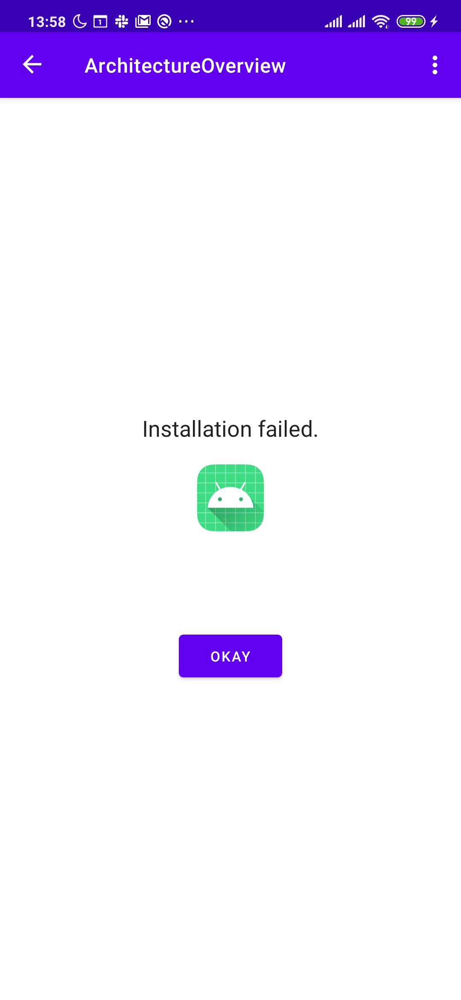
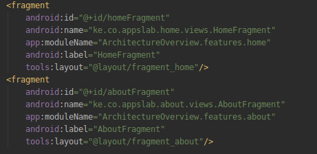
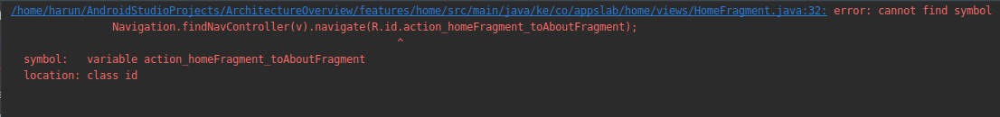

# ArchitectureOverview
Sample app that shows how to use MVVM app architecture, architecture components and the repository pattern in android using java

### Common Errors With Modules and How to Solve
#### Module Installation Error
 At times when starting out you may get this error as shown in thr following screenshot:
 
 <p align="center">
  
</p>

This is caused by naming the modules accordign to the default name in the `app:ModuleName` attribute in declaring the fragment in the nav graph. For this project, this is how Android Studio had generated the names:

 <p align="center">
  
</p>

To solve this, name the modules with the name that you named while creating the modules in our case this would be `home` and `about` else you will keep getting the module installation error.

#### Navigation Component Error
At times trying to navigate to a fragment which is in another module brings the following error:
 <p align="center">
  
</p>

This happens when you use:

```
Navigation.findNavController(v).navigate(R.id.action_homeFragment_toAboutFragment)

```

To solve this you use FragmentDirections which are generated classes by safeArgs

```
 NavDirections navDirections = HomeFragmentDirections.actionHomeFragmentToUsersFragment();
 Navigation.findNavController(v).navigate(navDirections);
```


